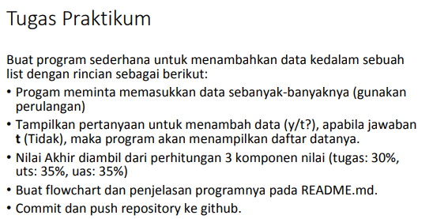
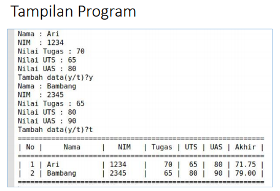
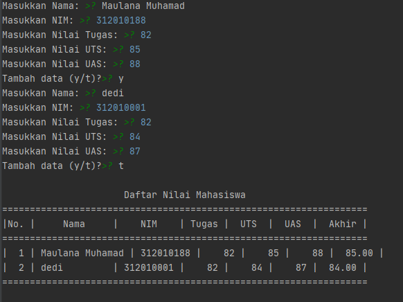

## Tugas 
Repository ini dibuat untuk memenuhi tugas Pertemuan 9 - Bahasa Pemrograman.
<hr>
Nama    : Maulana Muhamad <br>

NIM     : 312010188 <br>

Kelas   : TI.20. A.1 <br>
<hr>

## Pertemuan 9 - Lab 4





> jadi dibawah ini syntax untuk menambahkan beberapa data diantarnya NAMA, NIM, NILAI TUGAS, NILAI UTS Dan NILAI UAS.

```python
nama = input("Masukkan Nama: ")
    nim = input("Masukkan NIM: ")
    tugas = int(input("Masukkan Nilai Tugas: "))
    uts = int(input("Masukkan Nilai UTS: "))
    uas = int(input("Masukkan Nilai UAS: "))
    akhir = (tugas * 30/100) + (uts * 35/100) + (uas * 35/100)
```
> Dan syntax dibawah ini, untuk membuat sebuah pertanyaan YA(Y)/TIDAK(T)

```python
if (input("TAMBAHKAN DATA (Y/T)?") == ''):
    ulang = False
 ```

> selanjutnya, dibawah ini ada beberapa syntax yang ditambahkan agar tampilan akhir dari ouput menjadi sama persis seperti contoh output yang diberikan oleh dosen saya 

```python
nilai = []
ulang = True

while ulang:
    nama = input("Masukkan Nama: ")
    nim = input("Masukkan NIM: ")
    tugas = int(input("Masukkan Nilai Tugas: "))
    uts = int(input("Masukkan Nilai UTS: "))
    uas = int(input("Masukkan Nilai UAS: "))
    akhir = (tugas * 30/100) + (uts * 35/100) + (uas * 35/100)

    nilai.append([nama, nim, tugas, uts, uas, int(akhir)])
    if (input("Tambah data (y/t)?") == 't'):
        ulang = False

print("\n                      Daftar Nilai Mahasiswa")
print("==================================================================")
print("|No. |     Nama     |    NIM    | Tugas |  UTS  |  UAS  |  Akhir |")
print("==================================================================")
i = 0
for item in nilai:
    i += 1
    print("| {no:2d} | {nama:12s} | {nim:9s} | {tugas:5d} | {uts:5d} | {uas:5d} | {akhir:6.2f} |"
          .format(no=i, nama=item[0], nim=item[1], tugas=item[2], uts=item[3], uas=item[4], akhir=item[5]))
print("==================================================================")
```

> setelah run syntax diatas, maka akan muncul seperti gambar dibawah ini :


Sekian hanya ini yang dapat saya sampaikan, semoga bermanfaat.

#TERIMAKASIH